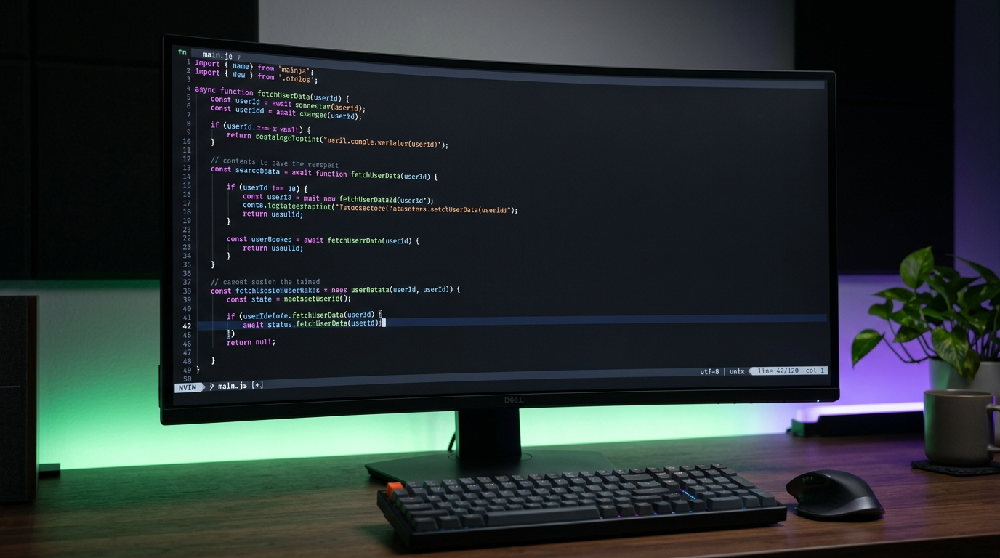

<div align="center">
  
  
  # Nano GUI 🚀
  
  ### *The ultimate terminal-grade, multi-tab text & code editor inspired by GNU nano, supercharged by Gemini AI.*
  
  [](https://opensource.org/licenses/Apache-2.0)
  [](https://developer.android.com)
  [](https://developer.android.com/jetpack/compose)
  [](https://deepmind.google)
</div>

<br />

<div align="center">
  
</div>

<br />

---

## 📖 Introduction
**Nano GUI** is a sleek, ultra-fast, and distraction-free mobile terminal editor cloning the authentic terminal atmosphere of `GNU nano`. Engineered natively in Kotlin and Jetpack Compose, it features a complete CLI text engine combined with responsive touch operations, a desktop-class multi-file tab system, instant regex-based syntax colorists, and server-side Gemini AI for intelligent file analysis and dynamic highlighting.

---

## ✨ Features Spotlight

### 🗂️ Desktop-Class Multi-File Tab Bar
* **Interactive Tabs:** Effortlessly open, edit, and switch between multiple files.
* **Auto-Marquee Scrolling:** When a filename is exceptionally long, it glides smoothly across its tab with sliding animations to keep the interface tidy.
* **Safe State Syncing:** Automatically tracks modification statuses, indicating unsaved drafts with an asterisk (`*`).
* **Unsaved Dialog Safeguard:** Warns you before closing any modified tab with options to save or discard changes.

### 🎨 Intelligent Syntax Highlighting
* **Optimized Local Engine:** Extremely fast, local pattern-based highlighter for a wide range of formats:
  * 📝 **Markdown (`.md`)** &mdash; Headers, lists, blockquotes, inline formatting, code blocks
  * 🌐 **Web Languages (`.html`, `.css`, `.js`)** &mdash; Tags, styles, selectors, attributes
  * ☕ **Native Core (`.java`, `.kt`, `.py`)** &mdash; Classes, keywords, strings, annotations, and comments
  * 📋 **Configurations & Markup (`.xml`, `.yml`, `.yaml`, `.conf`, `.sh`, `.bat`)** &mdash; Scripts, properties, variables, comments
  * 📊 **Clean CSV (`.csv`)** &mdash; Treated as plain text to prevent cluttering
* **Gemini AI Highlighting Fallback:** If a file uses an unfamiliar extension, Nano GUI uses integrated **Gemini API** to automatically analyze the contents and dynamically generate a tailored syntax coloring palette!

### 🔍 Elite Terminal Tools
* **Search & Replace:** Direct search query dialog with customizable match patterns and full-string replacements.
* **Quick Keyboard Shortcuts:** Authentic terminal shortcut key bindings available at a glance.
* **Responsive Exit Transitions:** Soft `fadeIn` and `scaleIn` entry & exit transitions that allow you to fluidly step in and out of your files.

---

## 🛠️ Technology Stack

| Component | Technology | Description |
| :--- | :--- | :--- |
| **Language** | Kotlin | Modern, concise, and safe programming language |
| **UI Kit** | Jetpack Compose (Material 3) | Declarative UI for beautiful, dynamic layouts |
| **AI Integration** | Gemini API | Server-side file classifier and palette creator |
| **Text Rendering** | Compose TextField | Custom high-performance text cursor state engine |
| **Data Parsing** | kotlinx.serialization | Type-safe JSON handling for syntax styles |

---

## 🚀 Getting Started

### Development Workspace
Ensure your environment meets the minimum development requirements:
* **Android Gradle Plugin (AGP):** 8.x
* **Kotlin Version:** Compatible JVM target
* **Min SDK:** 26+

### Building the Project
To compile and assemble the applet manually, run the following Gradle command inside the project root:
```bash
gradle :app:assembleDebug
```

---

<div align="center">
  <p>Made with ❤️ by the Nano GUI Developer Team</p>
</div>
